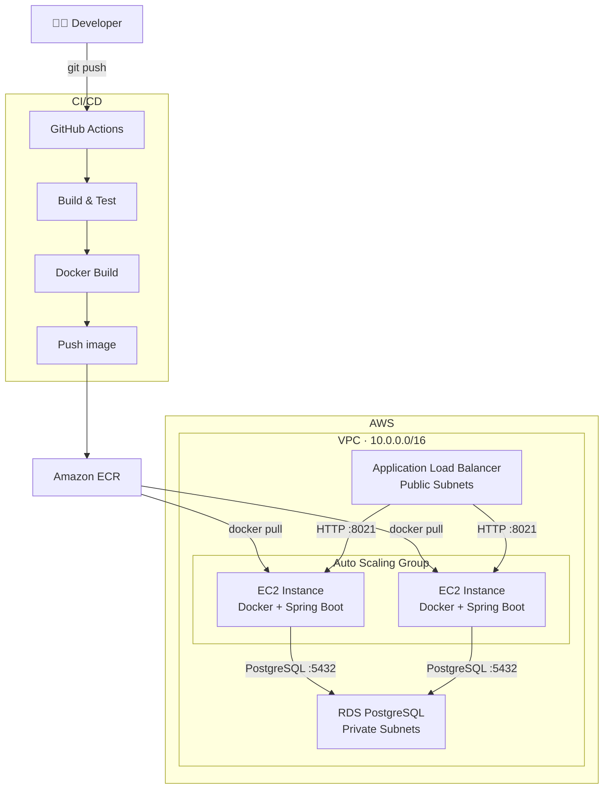
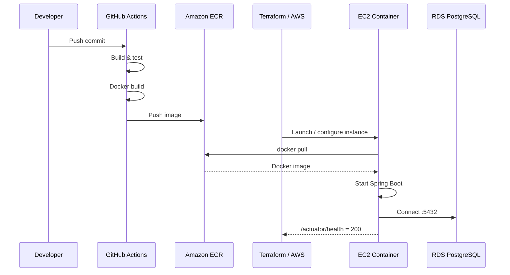
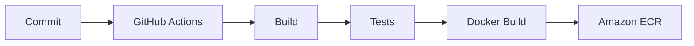

# AWS Microservice Infrastructure with Terraform — V2

Despliegue de un microservicio **Spring Boot sobre AWS**, completamente definido mediante **Terraform**, con Docker, Amazon ECR, GitHub Actions, Auto Scaling, Application Load Balancer y una base de datos PostgreSQL en RDS.

Este proyecto nació como un reto personal para llevar a la práctica conocimientos de AWS más allá de la teoría. La **V1** se centraba principalmente en la construcción de la infraestructura; en esta **V2** se incorpora Docker y se automatiza el proceso de build y publicación de la aplicación.

El objetivo es cubrir el ciclo completo:

> **Commit → CI/CD → Docker Build → Amazon ECR → EC2/Auto Scaling → Spring Boot → RDS**

---

## 📐 Arquitectura



### Flujo de despliegue



> **Nota:** el Auto Scaling Group está actualmente configurado con `min_size = 1`, `desired_capacity = 1` y `max_size = 1`. La política de Target Tracking está definida, pero con `max_size = 1` no puede aumentar el número de instancias. Para habilitar el escalado horizontal hay que incrementar `max_size`.

---

# 🚀 V2 — Evolución respecto a la V1

La V1 estaba enfocada en desplegar y entender los diferentes componentes de AWS:

- VPC
- EC2
- RDS
- Security Groups
- IAM
- Auto Scaling
- Load Balancing
- Terraform

La V2 añade una capa de automatización y containerización:

- 🐳 Dockerización de la aplicación
- 🔄 Pipeline de CI/CD con GitHub Actions
- 📦 Publicación automática de imágenes en Amazon ECR
- 🚀 Configuración del Launch Template para hacer pull de la imagen
- 🔐 Paso de configuración desde Terraform al `user_data`
- ♻️ Separación entre el proceso de **build** y el de **ejecución**

### Antes

```text
Código
  │
  ▼
AMI personalizada
  │
  ▼
EC2
  │
  ▼
Aplicación
```

Cada nueva versión de la aplicación podía implicar volver a preparar una imagen de máquina.

### Ahora

```text
Código
  │
  ▼
GitHub Actions
  │
  ├── Build
  ├── Test
  └── Docker Build
          │
          ▼
      Amazon ECR
          │
          ▼
      EC2 / ASG
          │
          └── docker pull
                  │
                  ▼
           Spring Boot
```

La aplicación queda desacoplada de la AMI. La máquina proporciona el entorno de ejecución y el contenedor contiene la aplicación.

---

# 🐳 Docker

La aplicación Spring Boot se empaqueta como una imagen Docker.

La misma imagen generada por el pipeline es la que posteriormente se descarga desde ECR y se ejecuta en las instancias EC2.

```text
Spring Boot
     │
     ▼
Docker build
     │
     ▼
Docker Image
     │
     ▼
Amazon ECR
     │
     │ docker pull
     ▼
EC2
     │
     ▼
Docker Container
     │
     ▼
Spring Boot
```

Esto permite separar claramente:

| Responsabilidad | Componente |
|---|---|
| Código fuente | GitHub |
| Build y tests | GitHub Actions |
| Empaquetado | Docker |
| Registry | Amazon ECR |
| Infraestructura | Terraform |
| Ejecución | EC2 + Docker |
| Base de datos | Amazon RDS |

---

# 🔄 CI/CD

GitHub Actions automatiza la construcción y publicación de la imagen Docker.

El flujo conceptual es:



El objetivo es que un cambio en el código pueda convertirse automáticamente en una nueva imagen disponible en AWS, eliminando pasos manuales del proceso de build y publicación.

---

# 🏗️ Infraestructura como código

Toda la infraestructura principal está definida mediante **Terraform**.

## Recursos principales

### Networking

- VPC
- Public Subnets
- Private Subnets
- Availability Zones
- Security Groups

### Compute

- EC2 Launch Template
- Auto Scaling Group
- Auto Scaling Policy
- IAM Instance Profile

### Load Balancing

- Application Load Balancer
- Listener
- Target Group
- Health Checks

### Database

- RDS PostgreSQL
- RDS Subnet Group

### Container Registry

- Amazon ECR

---

# 🌐 Networking

La VPC utiliza:

```text
10.0.0.0/16
```

Subnets públicas:

```text
10.0.101.0/24
10.0.102.0/24
```

Subnets privadas:

```text
10.0.1.0/24
10.0.2.0/24
```

La idea es separar los componentes según su exposición:

```text
                    Internet
                       │
                       ▼
              ┌─────────────────┐
              │       ALB       │
              │ Public Subnets  │
              └────────┬────────┘
                       │
                       ▼
              ┌─────────────────┐
              │       EC2       │
              │      Docker     │
              └────────┬────────┘
                       │
                       │ :5432
                       ▼
              ┌─────────────────┐
              │       RDS       │
              │ Private Subnets │
              └─────────────────┘
```

RDS está configurado como no públicamente accesible:

```hcl
publicly_accessible = false
```

---

# 🔐 Security Groups

Se utilizan Security Groups independientes para controlar el tráfico entre los diferentes componentes.

## EC2

Actualmente permite:

- SSH `22`
- Aplicación `8021`
- Tráfico de salida

## Application Load Balancer

Permite recibir tráfico HTTP en:

```text
8021
```

y reenviarlo hacia las instancias EC2.

## RDS

PostgreSQL escucha en:

```text
5432
```

pero el Security Group de RDS únicamente permite tráfico procedente del Security Group de EC2:

```hcl
referenced_security_group_id = aws_security_group.ec2.id
```

Por tanto, el acceso a la base de datos sigue el siguiente flujo:

```text
ALB
 │
 ▼
EC2
 │
 ▼
RDS
```

La base de datos no está expuesta directamente a Internet.

---

# ❤️ Health Checks

El Application Load Balancer utiliza Spring Boot Actuator para comprobar la salud de las instancias:

```text
GET /actuator/health
```

Configuración:

```hcl
health_check {
  path                = "/actuator/health"
  matcher             = "200"
  unhealthy_threshold = 5
  timeout             = 10
  port                = 8021
}
```

Esto permite al ALB detectar si una instancia está preparada para recibir tráfico.

---

# 📈 Auto Scaling

Las instancias se gestionan mediante un Auto Scaling Group.

Configuración actual:

```hcl
min_size         = 1
desired_capacity = 1
max_size         = 1
```

La política utiliza:

```text
ASGAverageCPUUtilization
```

con un target de:

```text
2%
```

La configuración está preparada para evolucionar hacia un escenario con varias instancias aumentando `max_size`.

Por ejemplo:

```text
                 Application Load Balancer
                           │
                 ┌─────────┴─────────┐
                 ▼                   ▼
              EC2 #1              EC2 #2
                 │                   │
                 └─────────┬─────────┘
                           ▼
                       RDS PostgreSQL
```

---

# 🗄️ RDS PostgreSQL

La aplicación utiliza PostgreSQL gestionado mediante Amazon RDS.

Configuración actual:

| Parámetro | Valor |
|---|---|
| Engine | PostgreSQL |
| Instance | `db.t3.micro` |
| Storage | 10 GB |
| Port | `5432` |
| Public access | Disabled |
| Preferred version | `17.6` |

La versión de PostgreSQL se obtiene mediante Terraform:

```hcl
data "aws_rds_engine_version" "test" {
  engine             = "postgres"
  preferred_versions = ["17.6"]
}
```

RDS está asociado a un DB Subnet Group compuesto por las subnets privadas.

---

# ⚙️ Configuración mediante `user_data`

Una de las piezas importantes de la V2 es la utilización del `user_data` del Launch Template.

Terraform genera dinámicamente el script de inicialización:

```hcl
user_data = base64encode(templatefile("init_script.sh", {
  db_host    = aws_db_instance.default.address
  db_name    = aws_db_instance.default.db_name
  db_user    = aws_db_instance.default.username
  db_pass    = aws_db_instance.default.password
  account_id = data.aws_caller_identity.current.account_id
}))
```

El flujo es:

```text
Terraform
   │
   ▼
Launch Template
   │
   ▼
user_data
   │
   ▼
EC2 initialization
   │
   ▼
Docker
   │
   ▼
Spring Boot
```

Esto permite configurar el contenedor cuando se inicializa una nueva instancia.

---

# 🔑 IAM y ECR

Las instancias EC2 utilizan un **IAM Instance Profile**.

El objetivo es proporcionar a las instancias los permisos necesarios para interactuar con AWS sin almacenar credenciales estáticas dentro de la máquina.

En la V2, esto es especialmente importante para que EC2 pueda autenticarse contra ECR y realizar:

```bash
docker pull
```

de la imagen de la aplicación.

---

# 🧠 Aprendizajes

Este proyecto comenzó como un ejercicio para aplicar conceptos de AWS y terminó siendo especialmente útil por los problemas encontrados durante la implementación.

## 1. Los recursos de una instancia importan

Durante la V1, la aplicación se reiniciaba constantemente en EC2 sin mostrar un error evidente en los logs de Spring Boot.

El problema estaba relacionado con la memoria disponible en una instancia `t2.micro`.

El sistema terminaba el proceso antes de que la aplicación pudiera arrancar correctamente.

Esto permitió entender que un fallo aparentemente relacionado con la aplicación puede tener realmente su origen en la infraestructura.

---

## 2. El ciclo de vida del servicio importa

Otro problema encontrado fue que las instancias tardaban varios minutos en apagarse correctamente.

La integración con **systemd** permitió gestionar de forma más adecuada el ciclo de vida del servicio.

Esto ayudó a entender mejor la relación entre:

```text
EC2
 │
 ├── Linux
 │
 ├── systemd
 │
 └── Application
```

---

## 3. Docker desacopla aplicación e infraestructura

Uno de los principales cambios de la V2 es eliminar la necesidad de generar nuevas AMIs para cada versión de la aplicación.

La AMI proporciona:

```text
Sistema operativo
+ herramientas necesarias
```

Mientras que la imagen Docker proporciona:

```text
Aplicación
+ runtime
+ dependencias
```

Esto permite que infraestructura y aplicación evolucionen de manera más independiente.

---

## 4. CI/CD hace el proceso reproducible

La V2 transforma el proceso de:

```text
Cambio de código
      ↓
Build manual
      ↓
Copiar aplicación
      ↓
Configurar EC2
```

en:

```text
Git push
   ↓
GitHub Actions
   ↓
Build + Tests
   ↓
Docker Build
   ↓
Amazon ECR
   ↓
EC2
   ↓
Docker Container
```

Esto acerca el proyecto a un flujo de despliegue más automatizado y reproducible.

---

# 📁 Estructura del proyecto

Una estructura aproximada del repositorio:

```text
.
├── .github/
│   └── workflows/
│       └── ...
│
├── terraform/
│   ├── main.tf
│   ├── variables.tf
│   ├── outputs.tf
│   ├── providers.tf
│   ├── init_script.sh
│   └── ...
│
├── src/
│   └── ...
│
├── Dockerfile
├── pom.xml
└── README.md
```

La estructura exacta puede variar dependiendo de la organización del repositorio.

---

# 🚀 Despliegue

## Requisitos

- AWS CLI
- Terraform
- Docker
- Java / Maven
- Cuenta de AWS
- Clave SSH para EC2
- Repositorio de GitHub con GitHub Actions habilitado

---

## 1. Configurar AWS

Configurar las credenciales de AWS mediante el mecanismo habitual de AWS CLI.

Comprobar que funcionan:

```bash
aws sts get-caller-identity
```

---

## 2. Configurar las variables de Terraform

Configurar las variables necesarias para el entorno.

Por ejemplo:

```hcl
aws_region     = "us-east-1"
instance_type  = "..."
local_ip_range = "..."
```

Los valores concretos dependerán del entorno donde se despliegue el proyecto.

---

## 3. Inicializar Terraform

```bash
terraform init
```

---

## 4. Revisar el plan

```bash
terraform plan
```

Revisar los recursos que Terraform propone crear antes de aplicar los cambios.

---

## 5. Aplicar la infraestructura

```bash
terraform apply
```

Terraform creará los recursos definidos en AWS.

---

# 🧹 Destruir la infraestructura

Para eliminar los recursos:

```bash
terraform destroy
```

> **Importante:** el RDS actual utiliza `skip_final_snapshot = true`. Al destruir la infraestructura, la instancia puede eliminarse sin conservar un snapshot final.

---

# 🔒 Consideraciones de seguridad

Este proyecto es principalmente un entorno de aprendizaje. Hay varios puntos que deberían mejorarse antes de utilizar esta arquitectura en producción.

### Credenciales de RDS

Actualmente la contraseña está definida directamente en Terraform:

```hcl
password = "..."
```

En un entorno real debería utilizarse un sistema de gestión de secretos, por ejemplo:

- AWS Secrets Manager
- AWS Systems Manager Parameter Store

### Otras mejoras posibles

- HTTPS mediante AWS Certificate Manager
- Route 53 + dominio propio
- GitHub Actions mediante OIDC
- IAM con mínimo privilegio
- Subnets privadas para las instancias de aplicación
- NAT Gateway o VPC Endpoints según necesidades
- ECR Lifecycle Policies
- CloudWatch Logs
- CloudWatch Metrics y alarms
- Rotación de credenciales
- Tags y naming conventions más consistentes
- Terraform State remoto mediante S3 + locking

---

# 🔮 Próximos pasos

- [ ] HTTPS mediante ACM
- [ ] Route 53 + dominio propio
- [ ] AWS Secrets Manager
- [ ] GitHub Actions mediante OIDC
- [ ] Auto Scaling real con `max_size > 1`
- [ ] Migrar EC2 a subnets privadas
- [ ] NAT Gateway / VPC Endpoints
- [ ] ECR Lifecycle Policies
- [ ] CloudWatch Logs
- [ ] CloudWatch Alarms
- [ ] Rolling / Blue-Green Deployments
- [ ] Versionado de imágenes Docker
- [ ] Entornos `dev` / `staging` / `prod`
- [ ] Modularización adicional de Terraform
- [ ] Terraform State remoto

---

# 🎯 Objetivo del proyecto

Más allá de crear una infraestructura funcional, el objetivo de este proyecto ha sido entender qué ocurre realmente cuando una aplicación pasa de ejecutarse localmente a ejecutarse en la nube.

La evolución ha sido:

```text
V1
│
├── VPC
├── EC2
├── RDS
├── Networking
├── Security Groups
├── IAM
├── Load Balancer
├── Auto Scaling
└── Terraform
```

↓

```text
V2
│
├── Docker
├── Amazon ECR
├── GitHub Actions
├── CI/CD
└── Containerization
```

El resultado es un flujo en el que desarrollo, build, distribución y ejecución están conectados:

```text
┌─────────────┐
│   GitHub    │
└──────┬──────┘
       │
       │ push
       ▼
┌─────────────┐
│   Actions   │
└──────┬──────┘
       │
       │ docker build
       ▼
┌─────────────┐
│     ECR     │
└──────┬──────┘
       │
       │ docker pull
       ▼
┌─────────────┐
│ EC2 / ASG   │
│   Docker    │
└──────┬──────┘
       │
       │ :5432
       ▼
┌─────────────┐
│     RDS     │
│ PostgreSQL  │
└─────────────┘
```

**El objetivo de esta V2 no es únicamente desplegar una aplicación, sino construir un pipeline reproducible que conecte desarrollo, build, distribución y ejecución sobre una infraestructura AWS definida completamente mediante código.**
